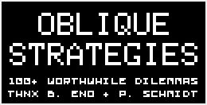
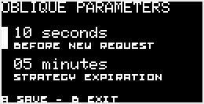
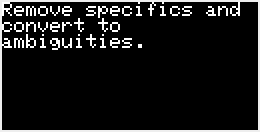
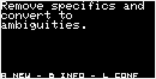
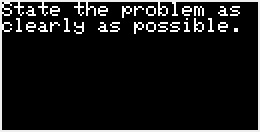
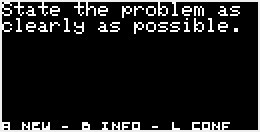

# Oblique Strategies for Arduboy

From [Wikipedia](https://en.wikipedia.org/wiki/Oblique_Strategies):

> Oblique Strategies (subtitled Over One Hundred Worthwhile Dilemmas) is a card-based method for promoting creativity jointly created by Brian Eno and Peter Schmidt, first published in 1975 […] Each card offers a challenging constraint intended to help artists (particularly musicians) break creative blocks by encouraging lateral thinking.

This [Arduboy](https://arduboy.com) app displays one strategy at a time. You must wait at least 30 seconds before you can request a new strategy by pressing the A button on the keypad (this delay is intentional, as you are supposed to reflect on the challenge). After 3 minutes, wether you press the A button or not, a new strategy will be displayed. These values can be changed in the configuration screen (press left button) and then they will be saved in the EEPROM.

